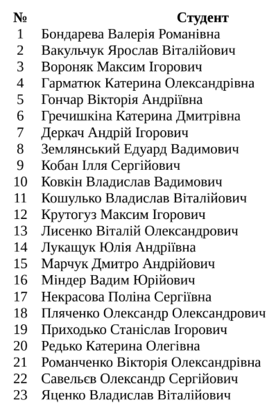
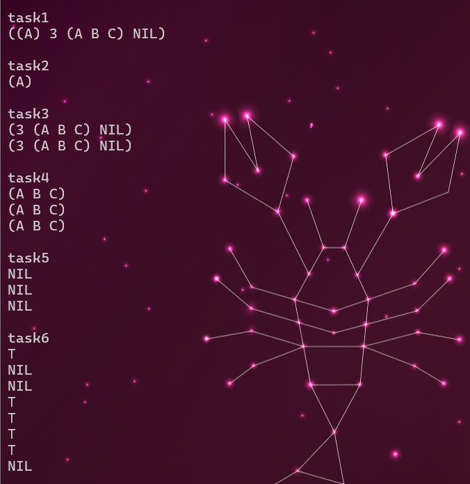
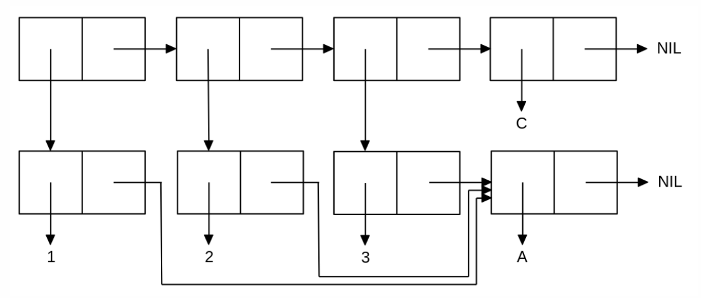

<p align="center"><b>МОНУ НТУУ КПІ ім. Ігоря Сікорського ФПМ СПіСКС</b></p>
<p align="center">
<b>Звіт з лабораторної роботи 1</b><br/>
"Обробка списків з використанням базових функцій"<br/>
дисципліни "Вступ до функціонального програмування"
</p>
<p align="right"><b>Студент</b>: Крутогуз Максим КВ-22</p>
<p align="right"><b>Рік</b>: 2025</p>

# Виконання Варіант 12
<p align="center">

</p>


## Загальне завдання
```lisp
;; General task

;; global variables
(defvar *list* nil)

;; constucting a list with required paramaters
(format t "~%~%task1")
(setf *list* '((a) 3 (a b c) nil)) 
(print *list*)

;; getting a list head
(format t "~%~%task2")
(print (car *list*))

;; get tail of the list
(format t "~%~%task3")
(print (cdr *list*))
(print (rest *list*))

;; trying to get the third item in the list
(format t "~%~%task4")
(print (third *list*))
(print (nth 2 *list*))
(print (car (cdr (cdr *list*))))

;; getting the last element
(format t "~%~%task5")
(print (car (last *list*)))
(print (nth (1- (length *list*)) *list*))
(print (car (cdr (cdr (cdr *list*)))))

;; usage atom and listp
(format t "~%~%task6")
(print (atom ()))
(print (atom '(1 3)))
(print (atom '(a b)))
(print (atom 1))
(print (listp ()))
(print (listp '(1 3)))
(print (listp '(a b)))
(print (listp 1))

;; usage other predicates
(format t "~%~%task7")
(print (eq (car *list*) (cdr (car *list*)))) ; is the same object?
(print (eq (car *list*) (car *list*)))
(print (eq 1 1))
(print (eq 1 1.0))
(print (eq *list* *list*))

(format t "~%")

(print (eql (car *list*) (cdr (car *list*)))) ; comparison for string, numbers
(print (eql (car *list*) (car *list*)))
(print (eql 1 1))
(print (eql 1 1.0))
(print (eql *list* *list*))

(format t "~%")

(print (equal (car *list*) (cdr (car *list*)))) ; comparison for string, numbers, lists
(print (equal (car *list*) (car *list*)))
(print (equal 1 1))
(print (equal 1 1.0))
(print (equal *list* *list*))

(format t "~%")

(print (equalp (car *list*) (cdr (car *list*)))) ; comparison for string, numbers, lists, different types
(print (equalp (car *list*) (car *list*)))
(print (equalp 1 1))
(print (equalp 1 1.0))
(print (equalp *list* *list*))

(format t "~%")

(print (numberp "1"))
(print (numberp 1))

(format t "~%")

(print (zerop 1))
(print (zerop 0))

(format t "~%")

(print (plusp 1))
(print (plusp 0))

(format t "~%")

(print (evenp 1))
(print (evenp 0))

(format t "~%task8")
(print (append *lst-last* '(1 2) (cdr *lst-last*)))
```

<p align="center">


</p>

## Виконання завдання за варіантом

<p align="center">

</p>

```lisp
(defun variant-task ()
      (let* ((list-a (list 'a))
            (list-1 (list 1 list-a))
            (list-2 (list 2 list-a))
            (list-3 (list 3 list-a)))
      (print (list list-1 list-2 list-3 'c))))

(variant-task)
```

<p align="center">

</p>