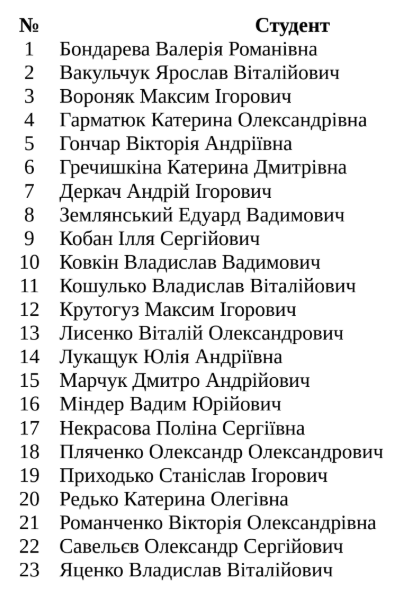
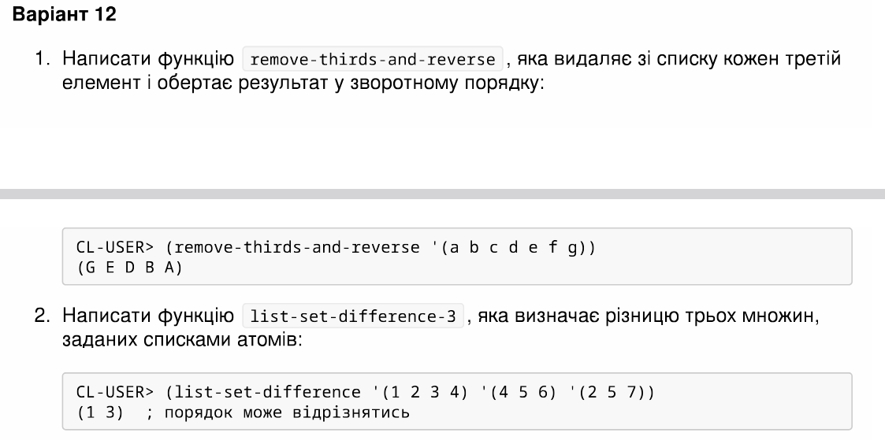
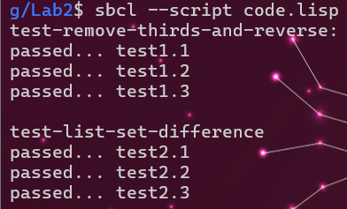

<p align="center"><b>МОНУ НТУУ КПІ ім. Ігоря Сікорського ФПМ СПіСКС</b></p>
<p align="center">
<b>Звіт з лабораторної роботи 2</b><br/>
"Рекурсія"<br/>
дисципліни "Вступ до функціонального програмування"
</p>
<p align="right"><b>Студент</b>: Крутогуз Максим КВ-22</p>
<p align="right"><b>Рік</b>: 2025</p>

# Виконання Варіант 12
<p align="center">

</p>


## Загальне завдання
Реалізуйте дві рекурсивні функції, що виконують деякі дії з вхідним(и) списком(-ами), за
можливості/необхідності використовуючи різні види рекурсії. Функції, які необхідно
реалізувати, задаються варіантом (п. 2.1.1). Вимоги до функцій:

1. Зміна списку згідно із завданням має відбуватись за рахунок конструювання нового
списку, а не зміни наявного (вхідного).
2. Не допускається використання функцій вищого порядку чи стандартних функцій
для роботи зі списками, що не наведені в четвертому розділі навчального
посібника.
3. Реалізована функція не має бути функцією вищого порядку, тобто приймати функції
в якості аргументів.
4. Не допускається використання псевдофункцій (деструктивного підходу).
5. Не допускається використання циклів.

Кожна реалізована функція має бути протестована для різних тестових наборів. Тести
мають бути оформленні у вигляді модульних тестів (див. п. 2.3).
Додатковий бал за лабораторну роботу можна отримати в разі виконання всіх наступних
умов:

* робота виконана до дедлайну (включно з датою дедлайну)
* крім основних реалізацій функцій за варіантом, також реалізовано додатковий
варіант однієї чи обох функцій, який працюватиме швидше за основну реалізацію,
не порушуючи при цьому перші три вимоги до основної реалізації (вимоги 4 і 5
можуть бути порушені), за виключенням того, що в разі необхідності можна також
використати стандартну функцію copy-list
## Варіант 12


## Лістинг функції remove-thirds-and-reverse
```lisp
(defun remove-thirds-and-reverse (lst)
  (remove-thirds-and-reverse-inner lst 0))


(defun remove-thirds-and-reverse-inner (lst index)
  (if lst
    (if (eql (rem (1+ index) 3) 0)
      (remove-thirds-and-reverse-inner (rest lst) (1+ index))
      (append (remove-thirds-and-reverse-inner (rest lst) (1+ index)) (list (first lst))))))
```
### Тестові набори та утиліти для remove-thirds-and-reverse
```lisp
(defun check-remove-thirds-and-reverse (name input expected)
  (format t "~:[FAILED~;passed~]... ~a~%" (equal (remove-thirds-and-reverse input) expected)
	  name))


(defun test-remove-thirds-and-reverse ()
  (format t "test-remove-thirds-and-reverse:~%")
  (check-remove-thirds-and-reverse "test1.1" '(a b c d e f g) '(g e d b a))
  (check-remove-thirds-and-reverse "test1.2" '(1 2 3 (3 4) (5 6)) '((5 6) (3 4) 2 1))
  (check-remove-thirds-and-reverse "test1.3" '((1 2 3)) '((1 2 3)))
  (format t "~%"))
```
## Лістинг функції list-set-difference
```lisp
(defun remove-all (item lst)
  (cond
    ((not (listp lst)) nil)
    ((null lst) nil)
    ((eql item (first lst)) (remove-all item (rest lst)))
    (t (cons (first lst) (remove-all item (rest lst))))))


(defun list-set-difference (lst1 lst2 lst3)
  (cond
    ((and (first lst2) (first lst3)) (remove-all (first lst2) (remove-all (first lst3) lst1)))
    ((first lst2) (remove-all (first lst2) lst1))
    ((first lst3) (remove-all (first lst3) lst1))))


(defun list-set-difference (lst1 lst2 lst3)
  (cond
    ((null lst2) (remove-all (first lst3) lst1))
    ((null lst3) (remove-all (first lst2) lst1))
    (t (list-set-difference (remove-all (first lst2) (remove-all (first lst3) lst1)) (rest lst2) (rest lst3)))))
```
### Тестові набори та утиліти для list-set-difference
```lisp
(defun check-list-set-difference (name input1 input2 input3 expected)
  (format t "~:[FAILED~;passed~]... ~a~%" (equal (list-set-difference input1 input2 input3) expected)
	  name))


(defun test-list-set-difference ()
  (format t "test-list-set-difference~%")
  (check-list-set-difference "test2.1" '(1 2 3 4) '(4 5 6) '(2 5 7) '(1 3))
  (check-list-set-difference "test2.2" '(1 3 4 6 8) '(1 4 6) '(2 4 6) '(3 8))
  (check-list-set-difference "test2.3" '(9 3 a 2 g d) '(d 3 1) '(1 4 6) '(9 a 2 g))
  (format t "~%"))
```

## Загальне тестування
```lisp
(test-remove-thirds-and-reverse)
(test-list-set-difference)
```


